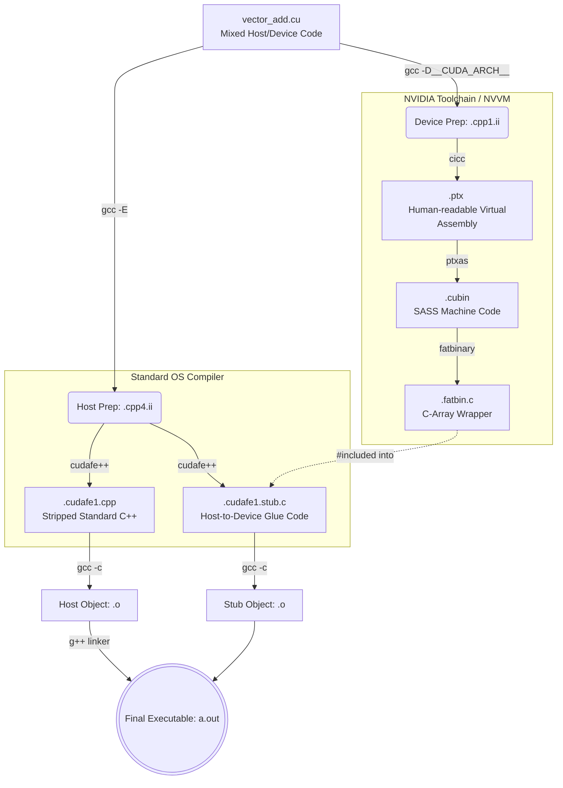

# 🔬 Project: NVCC Autopsy

> A surgical dissection of the NVIDIA CUDA Compiler Driver (`nvcc`).

Most developers treat `nvcc` as a black box. They feed it a `.cu` file and hope for an executable. This project rips open that box to trace **exactly** what happens at the source, intermediate, and assembly levels. 

By utilizing `--dryrun` and `--keep`, we trap the intermediate files and expose the exact lifecycle of a CUDA compilation: from Macro expansion, to Frontend surgical splitting, down to PTX assembly and Host-Side Stub generation.

---

## 🗺️ The Grand Architecture: The NVCC Pipeline

`nvcc` is **not a compiler**—it is a compiler driver. It acts as an orchestrator, splitting your mixed C++/CUDA code into two distinct pipelines (Host and Device) before fusing them back together.



---

## 🛠️ Quick Start & Reproduction

This repository uses a custom `Makefile` to trigger `nvcc`'s hidden diagnostic modes. 

1. **Clone and setup:**
   ```bash
   git clone <your-repo-link>
   cd nvcc-autopsy
   ```

2. **Run a Dry-Run Trace:**
   Captures the raw matrix of shell commands `nvcc` fires to sub-tools (`cicc`, `ptxas`, `fatbinary`).
   ```bash
   make trace
   # Look inside trace_logs/dryrun_log.txt
   ```

3. **Extract all Intermediate Files:**
   Forces `nvcc` to abort deletion of its temporary files, dumping the `.ii`, `.ptx`, and `.stub.c` files for analysis.
   ```bash
   make keep
   # Look inside the intermediates/ directory
   ```

---

## 📚 Deep Dive API Traces

This project categorizes the specific traces of major CUDA API functions. Read these docs to see how high-level C++ physically maps to hardware:

1. [**The Device Builtin Trace:** `__syncthreads()`](docs/01_syncthreads_trace.md)
   *How a C++ function call disappears and becomes a hardcoded PTX hardware barrier without standard linking.*
2. [**The Host Kernel Launch Trace:** `<<< >>>`](docs/02_kernel_launch_trace.md)
   *How the compiler surgically removes illegal C++ syntax, builds the `.fatbin` byte array, and constructs "Glue Stubs" to talk to the Linux Kernel.*

---
```
