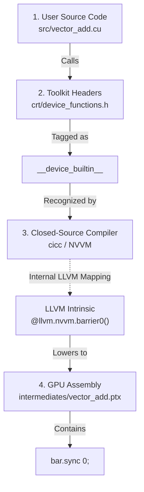

## 🗺️ The Translation Flow

```mermaid
graph TD
    A["1. User Source Code<br/>src/vector_add.cu"]
    B["2. Toolkit Headers<br/>crt/device_functions.h"]
    C["__device_builtin__"]
    D["3. Closed-Source Compiler<br/>cicc / NVVM"]
    E["LLVM Intrinsic<br/>@llvm.nvvm.barrier0()"]
    F["4. GPU Assembly<br/>intermediates/vector_add.ptx"]
    G["bar.sync 0;"]

    A -->|Calls| B
    B -->|Tagged as| C
    C -->|Recognized by| D
    D -.->|Internal LLVM Mapping| E
    E -->|Lowers to| F
    F -->|Contains| G
```
