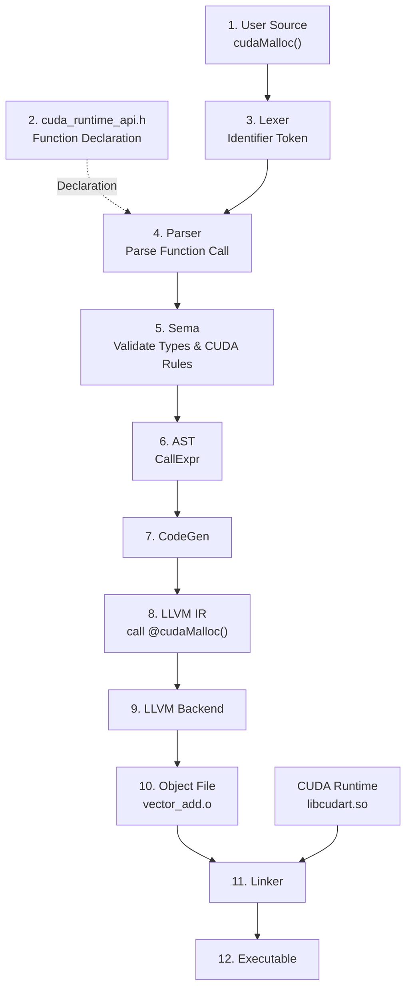

```mermaid
flowchart TD

    A["1. User Source<br/>cudaMalloc()"]

    B["2. cuda_runtime_api.h<br/>Function Declaration"]

    A --> C["3. Lexer<br/>Identifier Token"]
    B -. Declaration .-> D

    C --> D["4. Parser<br/>Parse Function Call"]

    D --> E["5. Sema<br/>Validate Types & CUDA Rules"]

    E --> F["6. AST<br/>CallExpr"]

    F --> G["7. CodeGen"]

    G --> H["8. LLVM IR<br/>call @cudaMalloc()"]

    H --> I["9. LLVM Backend"]

    I --> J["10. Object File<br/>vector_add.o"]

    J --> K["11. Linker"]

    L["CUDA Runtime<br/>libcudart.so"] --> K

    K --> M["12. Executable"]
```
